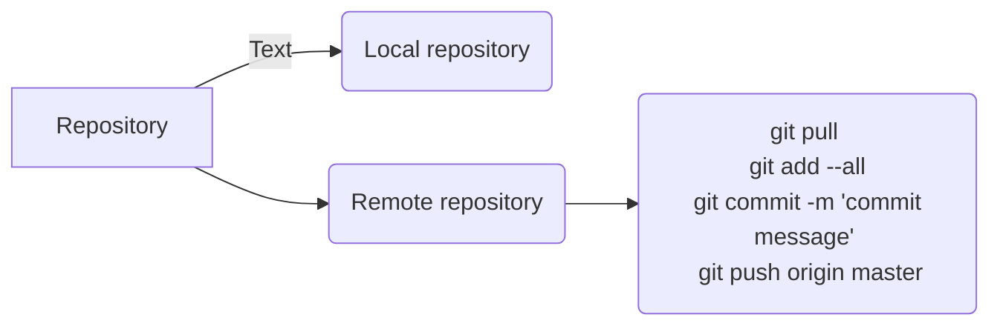

I describe what is git and how to use git in your data science or analytic workflow. Git is mostly used by software developers. But as data scientists are more and more working with software developers and data enginerss and other devops people, they need to understand at least the very basics of git and how to use it.  

{}

## What is git?

The way I see giit is the following. It may not be technically correct, but its how I understand it. 

Git is a version control system which can be used as a tool to track all the changes you make to your tex-like documents such as codes written in your favorite languages--R, Python, SAS, SQL or whatever.

You can also think of git as a central backup of you codes which you can access, download, make changes, and then backup them up again using only a handful of commands. 

## Why git?

```r
git pull
git add --all
git commit -m "updated the feature 1"
git push origin master
```




